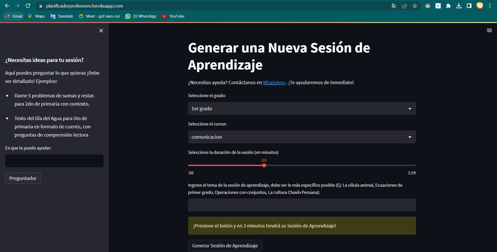
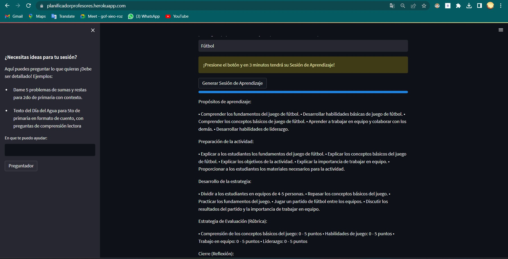
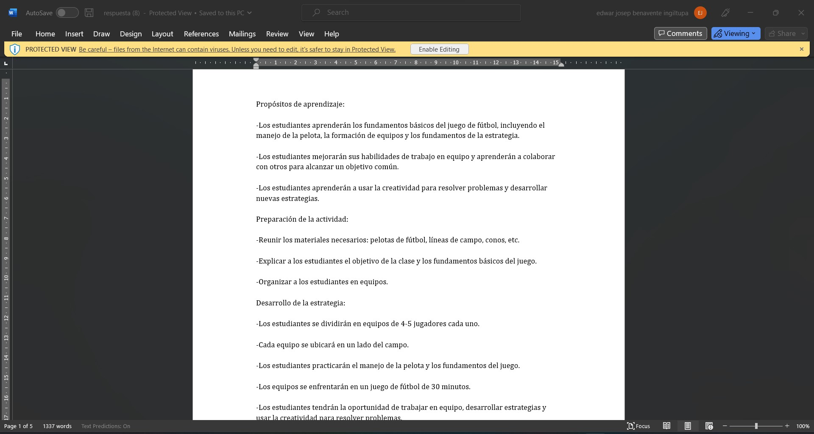

# Learning Session Generator
This is an app created with Streamlit and OpenAI API that generates a detailed learning plan for primary education teachers in Spanish. The learning plan includes components such as learning objectives, activity preparation, strategy development, assessment rubric, and reflection. The plan is generated using OpenAI's GPT-3 language model and includes a chatbot which also uses this engine. Finally, the user is allowed to download the responses in a .docx file. 

## App Link
* The app was deployed using Heroku and is accessible through this link: 
* https://planificadorprofesores.herokuapp.com/

## Installation
To run this app locally, follow these steps:

* Clone this repository.
* Install the required packages using pip install -r requirements.txt.
* Set the OPENAI_API_KEY environment variable to your OpenAI API key.

## Usage
To run the app, execute the command streamlit run app.py in the terminal.

When the app starts, you will be prompted to enter your username and password. If you are not registered, please contact the app administrator to create an account.

Once you have logged in, you will see the app interface. To generate a learning plan, select the grade level, subject area, and topic of the session. Then, click the "Generar Sesión de Aprendizaje" button. The app will generate a detailed learning plan in less than 3 minutes.

## Contributing
If you find a bug or have a feature request, please open an issue on this repository.

## License
This project is licensed under the MIT License.

## Photos
Screenshots of the project results are stored in the img folder.

 
 
 

 
